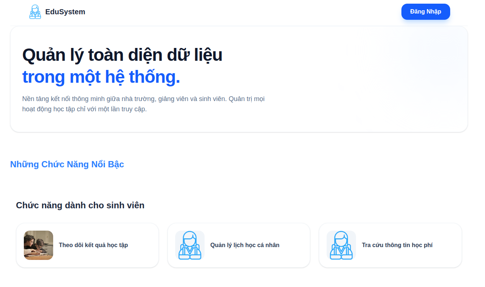
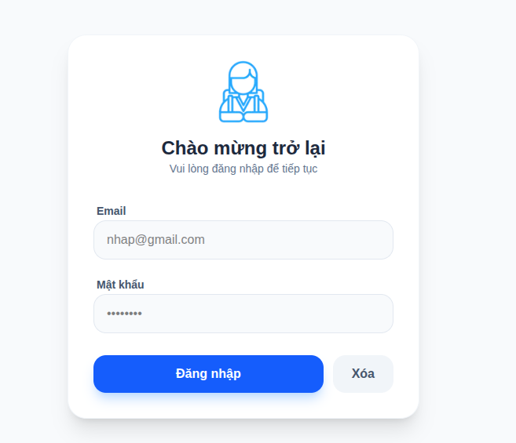
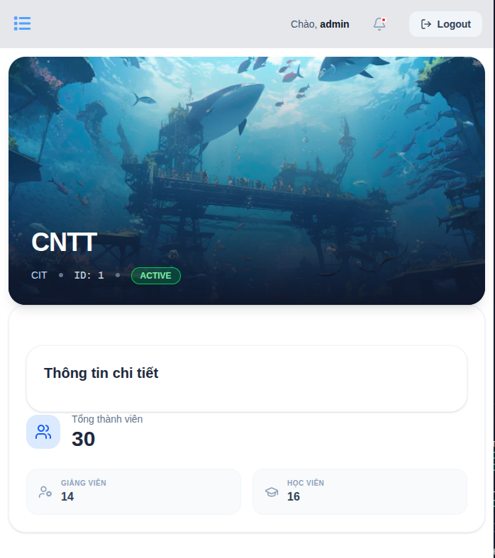

## 🎓 Project Journey & Reflection

This project was a collaborative effort with my friend [Long Beo] to sharpen our full-stack development skills. While we decided not to bring this specific project to a full production state to focus on deeper academic learning, the process was incredibly rewarding.

**Key Technical Takeaways:**
* **Frontend Architecture:** Deepened my understanding of Next.js, including advanced routing patterns and efficient data fetching.
* **Data Handling:** Developed strategies to clean and sanitize "dirty" data received from the backend, ensuring a smooth UI experience.
* **Debugging & Problem Solving:** Gained hands-on experience in tracking complex data flows and debugging state synchronization between client and server.

Although this project is currently archived, it serves as a foundational milestone in my journey as a full-stack developer. The skills I sharpened here are already being applied to my current projects.
*** Landing Page ***

*** Login ***

*** Faculty Detail ***
